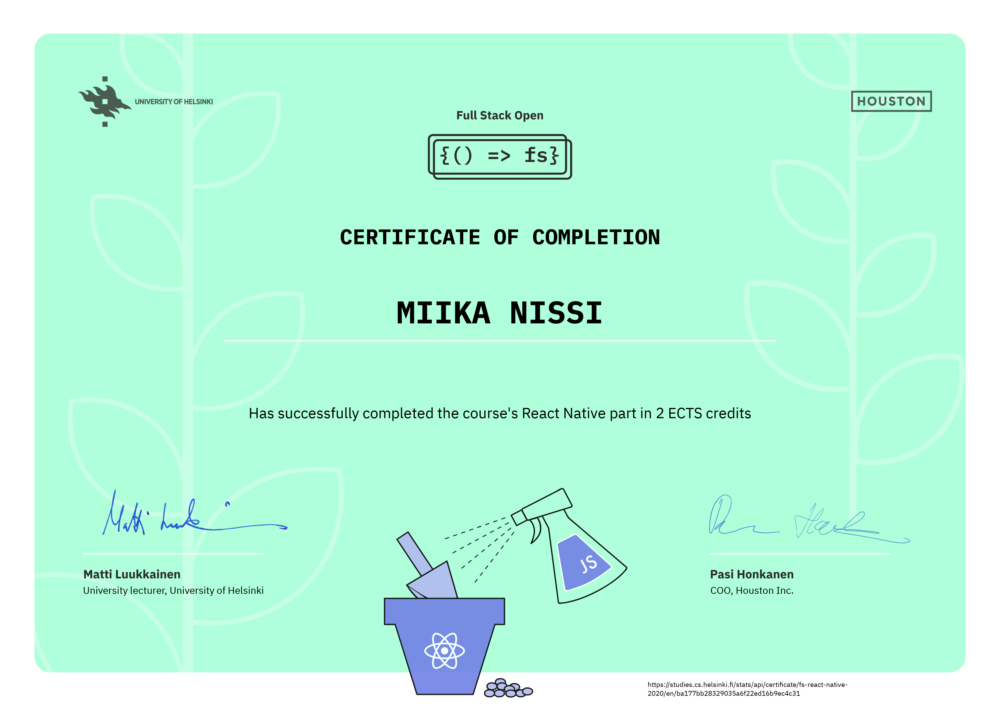

# Part 10

In this part, we will learn how to build native Android and iOS mobile applications with JavaScript and React using the React Native framework. We will dive into the React Native ecosystem by developing an entire mobile application from scratch. Along the way, we will learn concepts such as how to render native user interface components with React Native, how to create beautiful user interfaces, how to communicate with a server, and how to test a React Native application.

#### [Rate Repository App](./rate-repository-app)

## Course Certificate for this part

