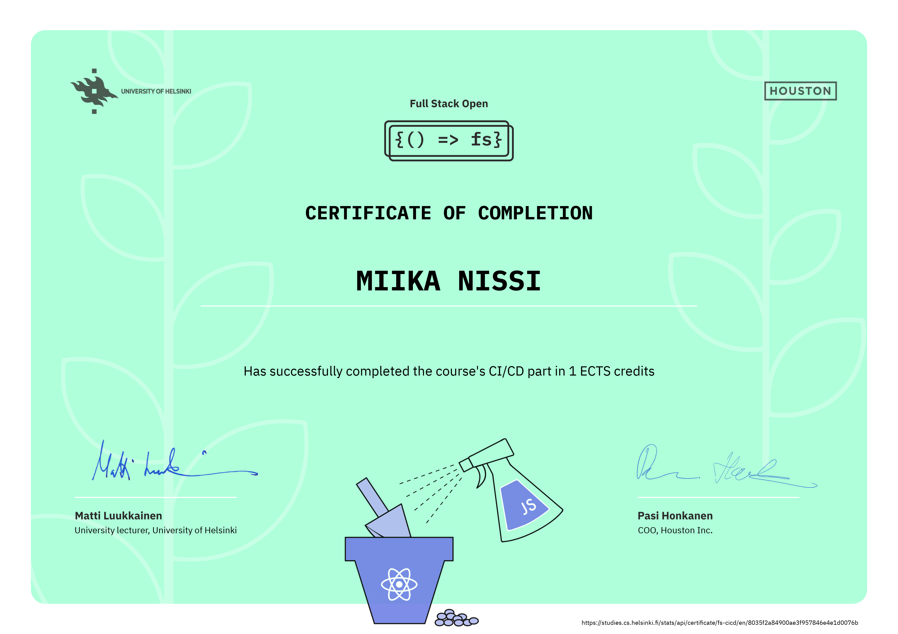

# Part 11

In this part, we will gain an understanding of why we should use a CI/CD system, what can one do for us, and how to get started with GitHub Actions which is available to all GitHub users by default.

As we are learning about CI/CD using GitHub actions the solutions are in seperate repositories listed below:

#### [Full Stack Open Pokedex](https://github.com/miikanissi/full-stack-open-pokedex/tree/main)

#### [Part 11.21](https://github.com/miikanissi/fullstackopen2021-part11.21/tree/main)

## Course Certificate for this part

