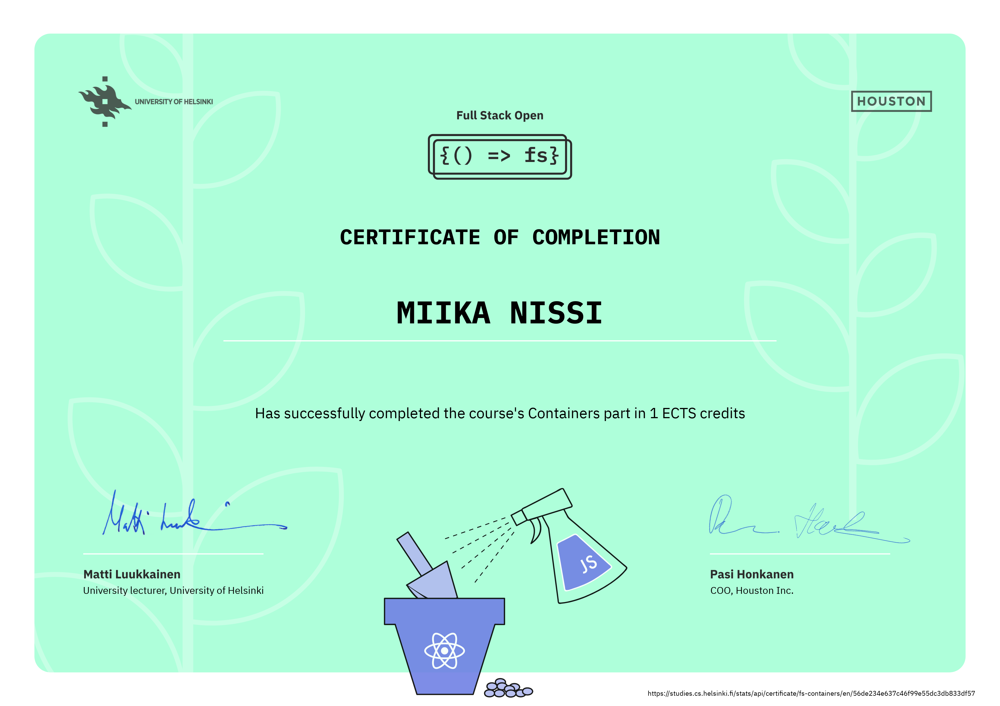

# Part 12

In this part, we will learn how to package code into standard units of software called containers. These containers can help us develop software faster and easier than before. Along the way, we will also explore a completely new viewpoint for web development outside of the now-familiar Node.js backend and React frontend.

We will utilize containers to create immutable execution environments for our Node.js and React projects. Containers also make it easy to include multiple services with our projects. With the flexibility, we will explore and experiment with many different and popular tools by utilizing containers.

#### [Blog List containerized](./bloglist)

#### [Docker Practice](./docker-practice)

#### [Script Answers](./script-answers)

#### [TODO App](./todo-app)

## Course Certificate for this part

