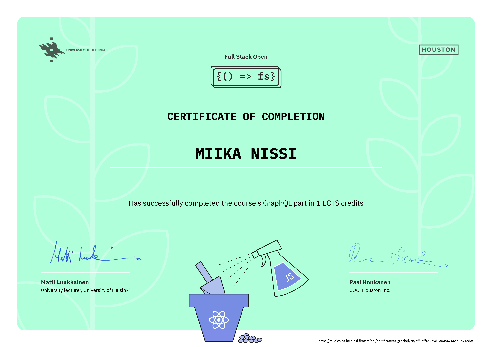

# Part 8

This part of the course is about GraphQL, Facebook's alternative to REST for communication between browser and server.

#### [Library Backend](./library)

#### [Library Frontend](./library-frontend)

## Course Certificate for this part

